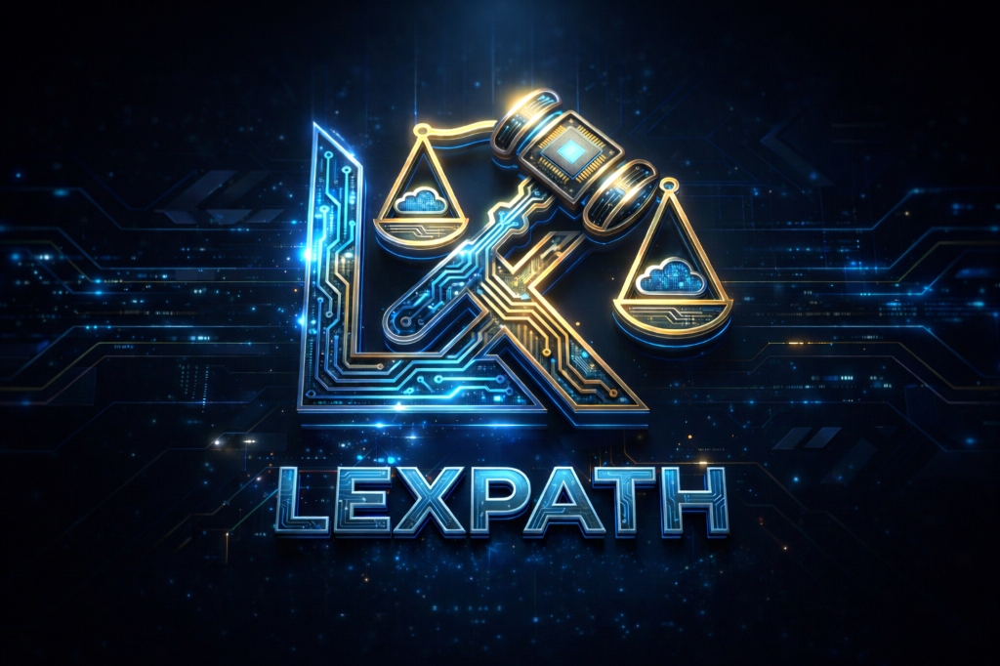

# LEXPATH ⚖️

**AI-Powered Legal Strategy Stress Tester**

LEXPATH is an adversarial AI simulator that stress-tests your legal strategies before you enter the courtroom. Get attacked by AI-powered adversaries that will expose every weakness in your case.



## 🎯 Features

- **5 Adversarial Personas**
  - 👨‍⚖️ The Hostile Judge - Interrogates legal theory
  - ⚔️ Opposing Counsel - Exploits procedural errors
  - 👥 Skeptical Jury - Tests emotional resonance
  - 📊 Corporate Auditor - Finds fiduciary breaches
  - 🔒 IP Guardian - Identifies infringement risks

- **Multi-AI Synthesis**
  - Primary analysis by Gemini 2.0 Flash
  - Devil's advocate critique by Qwen 3
  - Legal precedent citations by Saul 7B
  - Final synthesized verdict

- **Modern Chat Interface**
  - Gemini-style conversational UI
  - Real-time thinking indicators
  - Evidence image analysis
  - PDF document upload
  - Voice dictation support

## 🚀 Quick Start

```bash
# Clone the repository
git clone https://github.com/YOUR_USERNAME/lexpath.git
cd lexpath/lexpath-ui

# Install dependencies
npm install

# Run development server
npm run dev
```

## 🔑 API Keys

For full functionality, add your API keys:

1. **Gemini API** - Primary analysis engine
2. **Qwen API** (optional) - Devil's advocate
3. **Hugging Face API** (optional) - Saul 7B legal citations

Keys can be added via the Settings panel in the app.

## 🛠️ Tech Stack

- **Frontend**: React + TypeScript + Vite
- **Styling**: CSS with Jarvis teal theme
- **Backend**: Convex (serverless)
- **AI**: Google Gemini 2.0 Flash
- **Animations**: Framer Motion

## 📁 Project Structure

```
lexpath-ui/
├── src/
│   ├── App.tsx          # Main chat interface
│   ├── App.css          # Styling
│   ├── components/      # React components
│   └── services/        # AI integration
├── convex/              # Backend functions
└── public/              # Static assets
```

## 🌐 Deployment

The app is configured for:
- **Frontend**: Vercel/Netlify
- **Backend**: Convex Cloud

## 📄 License

MIT License - Feel free to use and modify.

---

Built with ❤️ for the legal tech community.
